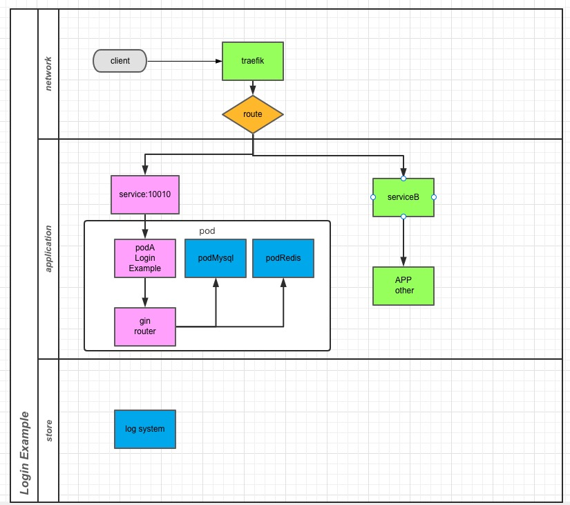

> [English version](README_EN.md)

> [中文版](README.md)

## 说明

1. MACOS 系统依赖下面的软件
   - docker (Docker Desktop)
   - Kubernetes (Docker Desktop)
     - 需要修改镜像地址
     - `vim ~/.docker/daemon.json`
     - 把下面内容添加到 json 中: `"registry-mirrors":["https://u99q7fs9.mirror.aliyuncs.com"]`
   - Make
   - helm
   - golang v1.16
2. 本程序限制
   - 开发环境是 MACOS，Windows 下没有做过兼容
   - deployments 中`traefik`没有启用，可以使用`127.0.0.1:30010`进行调试
   - 使用 30010 端口，本地电脑要确保没有被占用

## 编译和运行

- `cd build`
- `make docker`
- `make install`

## 测试方式

#### curl 方式

1. 创建用户：
   - `curl -X POST -d 'username=foo&password=xx22@4' "http://127.0.0.1:30010/v1/users/create"`
2. 用户登录
   - `curl -X POST -d 'username=foo&password=xx22@4' "http://127.0.0.1:30010/v1/login`

#### 单测方式

1. 简单运行单元测试
   `go test -v`

## 目录结构：

```
├── README.md
├── app
│   ├── controllers
│   ├── models
│   └── service
├── build
│   ├── Dockerfile
│   ├── Makefile
│   ├── helm_loginExample
│   └── log
├── cmd
│   ├── root.go
│   └── server.go
├── conf
│   └── conf.yaml
├── constants
│   ├── common.go
│   └── status.go
├── diagram.jpg
├── go.mod
├── go.sum
├── log
├── main.go
├── main_test.go
├── server
│   ├── initialize.go
│   └── server.go
└── util
    ├── cache
    ├── db
    ├── file
    ├── logger
    └── response
```

## 架构图


