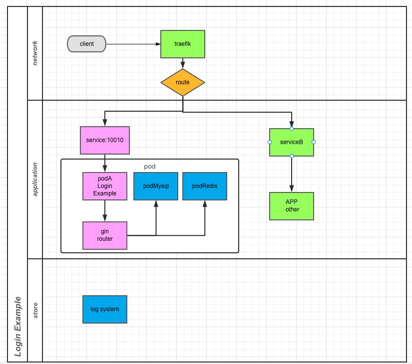

> [English version](https://github.com/yeer/loginExample/blob/master/README_EN.md)

> [中文版](https://github.com/yeer/loginExample/blob/master/README.md)

## illustrate

1. The MACOS system relies on the following software
   - docker (Docker Desktop)
   - Kubernetes (Docker Desktop)
   - Need to modify the mirror address -`vim ~/.docker/daemon.json`
   - Add the following content to json: `"registry-mirrors":["https://u99q7fs9.mirror.aliyuncs.com"]`
   - Make
   - helm
   - golang v1.16
2. Limitations of this program
   - The development environment is MACOS, and there is no compatibility under Windows
   - `traefik` is not enabled in deployments, you can use `127.0.0.1:30010` for debugging
   - Use port 30010, and ensure that the local computer is not occupied

## Compile and run

- `cd build`
- `make docker`
- `make install`

## Test method

#### Curl method

1. Create a user: -`curl -X POST -d'username=foo&password=xx22@4' "http://127.0.0.1:30010/v1/users/create"`
2. User login -`curl -X POST -d'username=foo&password=xx22@4' "http://127.0.0.1:30010/v1/login`

#### Single test method

1. Simply run unit tests
   `go test -v`

## Directory Structure:

```
├── README.md
├── app
│   ├── controllers
│   ├── models
│   └── service
├── build
│   ├── Dockerfile
│   ├── Makefile
│   ├── helm_loginExample
│   └── log
├── cmd
│   ├── root.go
│   └── server.go
├── conf
│   └── conf.yaml
├── constants
│   ├── common.go
│   └── status.go
├── diagram.jpg
├── go.mod
├── go.sum
├── log
├── main.go
├── main_test.go
├── server
│   ├── initialize.go
│   └── server.go
└── util
    ├── cache
    ├── db
    ├── file
    ├── logger
    └── response
```

## Architecture diagram


